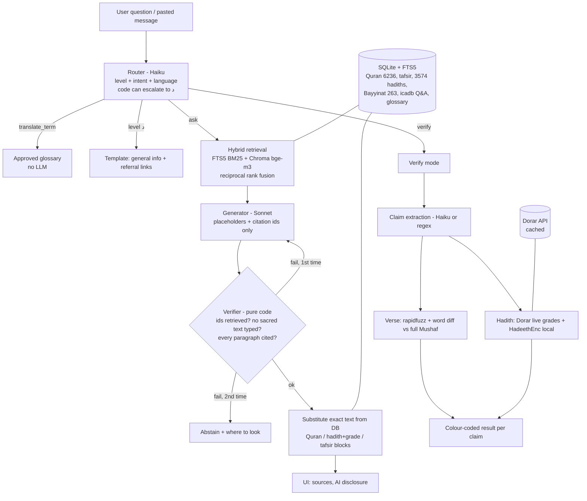

# بصيرة — Baseera

**An Arabic-first, grounded Islamic Q&A and verification assistant** built for the *AI Challenge Serving Islamic Content*.

Baseera answers **only** from approved sources, shows a verified source for every stretch of explanation, separates Quran / hadith / tafsir text from AI-generated explanation, and **abstains** (with places to look) when the evidence is not enough. It is an AI tool, not a mufti, and stores no personal data.

Two modes:

1. **Ask** — a question in Arabic or English → a sourced answer with source cards.
2. **Verify** — paste a viral message → every verse and hadith in it is checked: verified verse / misquoted verse (correct text + word diff) / hadith graded by scholars / not found in approved sources.

## Live demo (for judges)

**Link:** https://answer-late-patients-obvious.trycloudflare.com (nothing to install, no account, free, works on a phone).

- Runs the **local open model** (Gemma 12B through LM Studio, on one desktop GPU) behind a Cloudflare tunnel. No paid API is used for answers.
- Example questions on the home page and the quick tools answer in a few seconds (pre-computed with the same model); a **new** question takes about 20-60 seconds. Two questions are answered at a time, and if you are waiting the page shows your place in line.
- Try: the **Verify** tab with the "viral message" example, then ask about the pillars of Islam, or ask a personal-case question to see the referral behaviour.
- Privacy: no accounts, questions are not stored or logged (the answer cache is read-only while the demo runs), and Baseera says clearly that it is an AI tool.
- If the link is down, contact the team; running it yourself is documented in `docs/QUICKSTART.md`.

Operator notes: `start_demo.ps1` (settings in `.env.demo`, see `.env.demo.example`) starts the model server, the app and the tunnel and restarts them if they stop; `tools/prewarm_cache.py` fills the cache after the last change.

## The design rule that matters

> **The LLM never types a verse or a hadith.** It emits placeholders (`{{quran:2:255}}`, `{{hadith:hadeethenc:4560}}`, `{{tafsir:2:255}}`) and `[[passage-id]]` citations. Plain code (`core/verify.py`, no LLM) checks them and substitutes the exact stored text.

Enforced in code, not just prompts:

| Rule | Where |
|---|---|
| Placeholders/citations must refer to passages *retrieved for this question* (invented ids fail) | `core/verify.py` |
| Model-written Quran text is rejected (ornate brackets, quotes, or fuzzy-matching ≥93% against the whole Mushaf) | `core/verify.py` |
| Arabic text in quotation marks only as a verbatim, cited quote of a retrieved scholarly passage | `core/verify.py` |
| Every paragraph carries a citation | `core/verify.py` |
| On verification failure: regenerate once with the error fed back, then abstain | `core/pipeline.py` |
| Hadith grades only from Dorar / HadeethEnc data (keyword classification in code, never the model) | `core/verifier_mode.py`, `core/dorar.py` |
| Level **د** (personal case) never reaches the generator: template + general info + referral | `core/pipeline.py` |
| Code can only *escalate* the router's level to د, never relax it | `core/router.py` |
| Approved glossary translations override the model (`ترجم كلمة التوحيد` is answered from the glossary, no LLM) | `core/glossary.py` |
| Any LLM/API failure fails closed (abstain), never guesses | `core/pipeline.py` |
| Scope remarks ("not exhaustive", "scholars differ", "ask a scholar") are code-owned `{{note:...}}` markers: the model cannot write uncited disclaimers | `core/verify.py`, `core/generate.py` |
| Every 8+ word stretch of explanation carries its own `[[id]]` (a placeholder does not cover the text around it); the retry sees its rejected answer and a fix recipe | `core/verify.py`, `core/pipeline.py` |

## Architecture



## Sources

| Source | Used for | How |
|---|---|---|
| King Fahd Complex Mushaf (Hafs v3.0 JSON) | Quran text — ground truth, 6,236 verses asserted | local zip |
| QuranEnc `english_saheeh` (Noor International) | English translation of verses | local sqlite zip |
| KFGQPC *Tafseer Muyassar* | Arabic concise tafsir, verse level (kept separate from Quran text) | local zip |
| HadeethEnc.com | 3,574 authenticated hadiths with explanations, grades (Arabic + English). *Credit to HadeethEnc.com is shown; content is never modified.* | API → SQLite |
| Bayyinat (dawa.center/file/7937) | 263 Q&As on doubts and objections (PDF parsed; Arabic ligature corruption repaired) | local PDF |
| icadb.com (Q&A, terminology) | 543 approved Q&A cards, 58 approved terminology cards | API → SQLite |
| icadb.com books | about 335 of the organizers' 345 books (fiqh, hajj and umrah, funerals, women's rulings, prayer, creed...), about 40,000 distinct passages; keyword search | API → SQLite |
| icadb.com encyclopedias | 2,632 Quranic word meanings, 291 notable people, 78 places, 58 sects and religions, 104 Names of Allah, 82 particles of meaning (icadb hadith cards are deliberately not used: hadith text and grades come only from HadeethEnc and Dorar) | API → SQLite |
| Dorar Fiqh Encyclopedia (dorar.net/feqhia) | 2,489 articles (4,595 passages): positions of the schools with references; each passage links to its page | polite crawl → SQLite |
| Glossary (docs/data.pdf p.7) | approved English equivalents; override machine translation | code |
| Dorar `dorar_api.json` | scholars' hadith grades (live, cached, polite throttling) | API |
| mp3quran.net | optional recitation audio on verse cards | API |
| islamqa.info, binbaz.org.sa, binothaimeen.net | referral links only (never scraped) | links |

**Reviewers / judges:** `docs/QUICKSTART.md` is the five-minute path, and `python tools/make_package.py` builds `dist/Baseera-working-copy.zip` (the committed code plus the ready-built sources database, so nothing needs ingesting). A fresh `git clone` has no database (it is git-ignored: sources are third-party), so use that zip or run the ingest below.

## Run it

Requires Python 3.13 (3.11+ should work). First time:

```bash
python -m venv .venv && .venv\Scripts\activate      # Windows; use source .venv/bin/activate elsewhere
pip install -r requirements.txt
echo ANTHROPIC_API_KEY=sk-ant-... > .env              # needed for Ask/Verify LLM steps (everything else runs without it)
python ingest/download_raw.py                         # fetches QuranEnc + Bayyinat; tells you which Quran Complex zips to place by hand
python ingest/build_all.py                            # ingest everything + embed (bge-m3, ~30-60 min on CPU, resumable)
uvicorn api.main:app                                  # http://127.0.0.1:8000
```

### Test it with a free local model (Gemma 4 12B, no API key)

The tested local model needs **no key**: it runs on your own machine through [LM Studio](https://lmstudio.ai) (a 16 GB GPU is enough; 7 GB download).

1. In LM Studio, download `gemma-4-12b-it` (Q4_K_M, from the `unsloth/gemma-4-12b-it-GGUF` repo), load it, and start the local server (default `http://localhost:1234`). Command line: `lms load gemma-4-12b-it --gpu max --parallel 1` then `lms server start`.
2. Put these lines in your own `.env` (never commit it; no secret is needed):

```
LLM_PROVIDER=local
LOCAL_BASE_URL=http://localhost:1234/v1
LOCAL_MODEL=gemma-4-12b-it
LOCAL_NO_THINK=1
LLM_GEN_MAX_TOKENS=1500
LLM_ROUTER_MAX_TOKENS=600
```

3. `uvicorn api.main:app` and open http://127.0.0.1:8000 (an answer takes about 30-60 s on a 16 GB GPU).

No GPU? One teammate can enable "Serve on Local Network" in LM Studio and the others set `LOCAL_BASE_URL=http://<that-computer-ip>:1234/v1` (same network only; the server has no password, so do not expose it to the internet). Cloud models also work: set `LLM_PROVIDER=openai` or `anthropic` with your own key in `.env`.

Manual files (from https://qurancomplex.gov.sa/quran-dev): `data/raw/quran/kfgqpc_hafs_v30.zip`, `data/raw/tafsir/hafs_tafseerMouaser_v3.zip`.

Without `ANTHROPIC_API_KEY` the app still runs: routing falls back to heuristics, level-د referral, glossary translation and **Verify mode** work, and Ask returns the closest approved sources (`retrieval_only`) instead of a generated answer. Nothing is ever fabricated.

```bash
python -m pytest -q                      # tests (data integrity, normalization, verifier adversarial cases, pipeline, verify mode)
python evals/run_evals.py                # golden-set evaluation -> evals/reports/latest.html
python evals/run_evals.py --offline      # the subset that needs no LLM
```

Pages: `/` main UI · `/retrieval` raw hybrid-retrieval debug view · `/docs` API.

## Evaluation

`evals/golden.jsonl` has the 12 challenge test cases (data pack p.6) + 43 more (55 cases in total: levels أ/ب/ج/د, viral messages, question-understanding and hadith-wording cases). The 4 viral entries marked `provisional` are well-known weak/fabricated hadiths — replace them with real examples from Dorar's *widespread hadiths* section.

### Results (live run, 52 cases, router `gpt-5.4-mini`, generator `gpt-5.6-sol`, judge `gpt-5.5`)

Full report: `evals/reports/latest.html` (per-case traces are in the matching `results-*.json`).

| Metric | First live run | Final live run |
|---|---|---|
| Verse fidelity (no model-typed Quran text) | 100% | **100%** (40/40) |
| Citation rate | 89.7% | **100%** (39/39) |
| Correct abstention / referral (level د etc.) | 85.7% | **100%** (7/7) |
| Verify mode (viral messages) | 100% | **100%** (5/5) |
| Retrieval recall (cases with known targets) | 100% (8) | **100%** (12/12) |
| Router accuracy | 86.5% | **100%** (52/52) |
| False abstention on answerable questions | 0% | **0%** (0/30) |
| Verifier-forced abstention (target 0) | not measured | **0%** (0/39) |
| Behaviour pass rate | 98.1% | **100%** (52/52) |
| LLM-judge score (1-5) | 4.71 | 4.71 |
| Cited stretches flagged by the support check (log mode) | not measured | 2.3% (3/130) |

Outcomes: 40 answered, 6 referred (level د), 5 verified (verify mode), 1 abstained (dp6-06, the expected abstention). Three answers needed the retry (dp6-07, b-08, b-09); none needed more. dp6-07, the verifier false positive on the quoted shahada «لا إله إلا الله», now answers live.

How this run was produced: the first pass ran out of API credit part-way (27 cases clean, 25 hit HTTP 429). `python evals/run_evals.py --resume <results.json>` re-ran only the 25 tainted cases and merged them with the 27 clean ones (`is_tainted`: provider errors, judge failures, or the rule router standing in for the model). The meta line of the results file records this.

What the judge and the support check still point at (not fixed): the judge scores the contested-fiqh group lowest (c: 4.48) and flags a-15 (3.83: partial list of Quran prophets, flagged as non-exhaustive by the system note) and b-02 / c-03 (sensitive claims phrased too definitively). The support check flagged 3 stretches; one (dp6-02, a tafsir citation) is the same citation the judge called weakly related, the other two are loose framing sentences.

Caveats: one run on 52 cases; the router number is a little optimistic (the router rules were tuned while looking at this set); the judge is from the same vendor as the generator, so a Claude judge (`JUDGE_PROVIDER=anthropic` then `--rejudge`) would be a useful second opinion. Token use for a full run is roughly: generator 220k in / 20k out, judge 40k / 16k, router 19k / 1k; cases run in parallel (`--workers`, default 4), a full run takes about 5 minutes.

Unit/integration tests: **291 pass** (`python -m pytest -q`, plus one slow synthetic check with `-m slow`), including adversarial verifier cases, pipeline retry/abstain paths with a fake LLM, the OpenAI/Anthropic/local wrappers against stubs, API privacy checks, the eval runner (parallelism, resume), data-integrity assertions (6,236 verses) and retrieval on real questions. Tests need the ingested database (`python ingest/build_all.py`).

### Final results with all sources (local Gemma 4 12B, 2026-10-06)

| Suite | Result |
|---|---|
| Golden set, 55 cases (judge `gpt-5.5`), final build | behaviour **100% (55/55)**, router 100%, retrieval 14/14, citations 100%, verse fidelity 100%, correct abstention 7/7, false abstention 0/32, verifier-forced abstention 0/41, judge 4.89. (An earlier full run on the same sources scored 54/55: Gemma wrote a source id as `qa:icadb:aalam:10387` instead of `qa:icadb-aalam:10387` and the verifier refused it; the repair for such separator slips, with a unit test, fixed it.) |
| Reliability, 51 questions (re-run on the final build: same result) | should-answer 17/17 (3 relabelled from "no source" after the Dorar fiqh encyclopedia was added, see `evals/reliability.jsonl`), no-source 13/13, disputed 6/6, paraphrase outcome 5/5 |
| 82 IslamQA questions in English (`bulk_check.py`), same questions at each stage | real sourced answers 41, then 45 with the English-to-Arabic search step, then **59** with the new sources; declined 34, then 24, then **16**; all 23 answered "don't know"-tier questions carry a referral or limits note |
| Tests | 291 automated tests pass |

Not done for lack of time (and to avoid untested late changes): Dorar tafsir and creed encyclopedias, embedding the 40,000 book passages, and the second half of the IslamQA questions. Honest limits: each run is a single pass (small differences are within normal variation); the IslamQA labels (easy / hard / don't know) are heuristic; the 40,000 book passages are searched by keyword only; the golden set was tuned against, so its 98.2% is optimistic for new questions.

### Reliability and answer boundaries (`evals/reliability.py`, 51 questions, local Gemma 4 12B)

Built for the question "does it know when to answer and when to decline?", with the full answer to every question kept in `evals/reports/reliability-*.html` (git-ignored):

| Category | What must happen | Result |
|---|---|---|
| Should answer (14 direct questions the sources cover) | answered, not refused | **14/14** |
| No sufficient source / out of scope (16, incl. invented or off-topic questions) | decline, refer, ask for clarification, or answer *with* a limits note; a confident answer fails | **16/16** |
| Disputed matters (6) | positions with a disputed / refer note, or decline | **6/6** |
| Paraphrase groups (5 groups x 3 wordings, incl. colloquial and English) | the outcome (answered / withheld) must not flip | **5/5** (the level label differed within 3 groups; the answer did not) |

What this suite found and fixed: a plain "what are the pillars of Islam?" answer was rejected because stating the shahada looked like copied hadith text (now a narrow stock-formula exemption, with a test that a real verse next to it is still caught); and the **on-topic check** below.

**On-topic check (`core/relevance.py`).** The verifier proves a citation is real and each sentence is backed by the passage it cites, but not that the cited passages *address the question*. On 48 detailed fiqh questions, some answers were assembled from correct but loosely related passages (e.g. zakat on jewellery gold answered with a general definition of zakat). The check asks the model one narrow question about the retrieved text only (answers / partial / unrelated), and **code** applies the result: partial or unrelated adds the fixed note "the passages do not address your question directly"; the answer is withheld only when the model says "unrelated" **and** the question's embedding similarity to the cited passages is low (two weak signals together, because each alone was trigger-happy). It can only make an answer more cautious, never add content. On the 48 questions after the fix: 40 answered (32 of them carrying a limits note), 8 declined (4 because the verifier rejected uncited or from-memory text, 1 on-topic, 3 no evidence); none of the declines is a wrong answer shown.

### Tone and order of evidence

- **Empathy first.** When a message contains first-person distress ("أشعر بالذنب...", "I feel hopeless"), the answer opens with a fixed, code-owned acknowledgement (`core/router.py: needs_empathy`, `core/pipeline.py: _with_empathy`). It is text we wrote, never model-generated, so it needs no citation and cannot hallucinate; it is not added to verify results.
- **Hierarchy of evidence.** The generation rules ask for the Quran first, then hadith, then the scholars' explanation (tafsir / Q&A / terms), and the eval reports `evidence_order_rate` (share of answers showing 2+ kinds in that order). Idea taken from reading how themuslimgpt.com describes its method; we enforce rules in code rather than only in the prompt.

### Local model (Gemma 4 12B on your own GPU, no API cost)

`LLM_PROVIDER=local` talks to any OpenAI-compatible server. Tested with LM Studio (Vulkan) on an RX 7600 XT 16 GB and `gemma-4-12b-it` Q4_K_M (7.1 GB):

```bash
lms load gemma-4-12b-it --gpu max --parallel 1
LLM_PROVIDER=local LOCAL_BASE_URL=http://localhost:1234/v1 LOCAL_MODEL=gemma-4-12b-it LOCAL_NO_THINK=1 LLM_GEN_MAX_TOKENS=1500 LLM_ROUTER_MAX_TOKENS=600 JUDGE_PROVIDER=openai python evals/run_evals.py --workers 1
```

Final run (55 cases): behaviour **100%**, router 100% (LLM router used every time), citations 100%, verse fidelity 100%, correct abstention 7/7, false abstention 0/32, verifier-forced abstention 0/41, first-attempt pass 85%, judge 4.86/5, 37 minutes. The one flaky retrieval miss (dp6-07: the glossary card for a term dropped by the model's restated question) is fixed in code: a glossary term in the user's own wording always brings its card (test + rerun of the 17 term-related cases: 17/17).

What it took (details in `docs/local_model_plan.md`): the first Gemma run scored 96.4% but never used the LLM router, because hidden reasoning consumed its token budget. Fixes: reasoning off (`reasoning_effort=none`; `/no_think` only works for Qwen), a repair step for citation syntax (`[[a], [b]]`, short ids; every id is still verified), one runtime retry for empty or cut-off replies, exact fix instructions on the verifier retry, a local-only prompt checklist (Claude/OpenAI prompts unchanged), and a rule for "prove this" requests that name nothing to prove. Environment knobs are listed in `.env.example`. Limits: LM Studio ignored context-length requests for this model (it reports 262144); the laptop (RTX 4050, 6 GB) is untested.

### Verify-mode calibration on synthetic data (`evals/synth_verify.py`, free, no LLM)

Exact labels from perturbing the Mushaf: exact verses, fragments, two-verse runs, 1-2 word substitutions / deletions / insertions / swaps, splices of two verses, heavily edited text and unrelated Arabic (2,856 verse cases), plus 1,000 hadith cases against the local HadeethEnc index.

| | Result |
|---|---|
| Verified (exact / fragment / Uthmani / multi-verse) | 868/868 correct |
| Misquoted (1-2 word edits) | 99.8% recall (was **73%** before a shortlist bug found by this data) |
| Fabricated (splices, heavy edits, non-Quran text) | 95.9% recall |
| Hadith match at `HADITH_MATCH_MIN=85` | precision 97.9%, recall 94.7% (best F1 at 80: 97.7%) |

The bug it found: a short verse that fits entirely inside the claim scored 100 in `partial_ratio` and crowded the right verse out of the candidate shortlist, so a one-word edit of a verse was reported as "not in the Quran". Fixed in `core/verifier_mode.py` with three restricted shortlists. Thresholds were deliberately left at `VERSE_MISQUOTE_MIN=0.72` (the sweep prefers 0.80, but calling a near-miss "misquoted" and showing the correct verse is the safer error) and `HADITH_MATCH_MIN=85` (favours precision, because a false match would attach the wrong grade). Caveat: synthetic edits are easier than real mis-remembering.

### Semantic support check (`core/support.py`, `evals/support_dev.py`)

Checks that a cited passage actually backs the sentence citing it (the verifier only checks form). Calibrated on 119 cited stretches from accepted answers: bge-m3 similarity separates the cited passage from a topically close uncited one with AUC 0.90 (0.96 against unrelated passages); the BAAI/bge-reranker-v2-m3 cross-encoder was no better (0.89) and ~100x slower, so it is not used. At the conservative threshold (keeps 99% of cited stretches) it catches ~24% of look-alike and ~45% of unrelated mis-citations, so it is a safety net, not a hallucination detector: default `SUPPORT_MODE=log` (scores stored in the debug trace and the eval metric `support_flag_rate`), `SUPPORT_MODE=enforce` makes an unsupported stretch a verifier error (retry, then abstain).

### Router: why there is no trained classifier (`evals/router_check.py`)

Checked, not assumed: the rule-based router (plus the LLM and code-level escalation) flags 0.4% (2/543) of real icadb general questions as personal cases, one of which is genuinely personal; a bge-m3 kNN classifier reaches only 77% leave-one-out on the 47 labelled golden questions, so it would need hundreds of labelled examples (which would have to be LLM-labelled). The router is ~0.4% of an eval run's tokens, so a trained one saves nothing. Revisit if the chosen local model routes poorly.

### Evals are parallel

`python evals/run_evals.py --workers 4` (default 4; 1 for a local model server): 3.7x faster live (134 s vs 498 s on 16 cases) with identical per-case outcomes.

## Learning over time (opt-in, human in the loop)

Baseera never changes itself from user input. The only thing it can keep is an **opt-in problem report**: a "report a problem" box under every result with a stated policy next to a consent checkbox; the button stays disabled until the box is ticked, and the server refuses (HTTP 400) any report without `consent: true`. A report stores the question, the outcome (status / level / intent / abstention reason), a 600-character answer excerpt, the cited source ids, the chosen reason and an optional comment. Never an IP address, user agent, session or account id; e-mail addresses, phone numbers and links are scrubbed; everything is deleted after 90 days (`REPORT_RETENTION_DAYS`, purged at every server start). Reports live in `data/db/reports.sqlite` (git-ignored).

A reviewer (you) then decides, with `python -m tools.review ...`: `approve-test` (becomes a permanent regression case in `evals/golden.jsonl`), `approve-rewrite` (a phrasing mapped to a clean question in `data/curated/rewrites.json`, applied before search from then on, near-exact matches only), `gap` (topic recorded in `data/curated/source_gaps.json`: what sources to add), `dismiss`, `summary`, `purge`. Learning therefore happens through reviewed, versioned files, not through hidden model changes. The three curated files are plain JSON/JSONL you can read and diff.

## Privacy

Without an opt-in report: no accounts, no analytics, no database of questions: requests are processed in memory. The access log strips query strings (so `/api/retrieve?q=…` is not logged). Third parties that receive text: **none for the live demo** (the model runs locally); with a hosted provider configured (**Anthropic** or **OpenAI**) the question and retrieved passages go to that provider for routing/generation. Also **Dorar** **Dorar** (hadith wording from a pasted message, to look up grades; the cached Dorar results can reveal which hadiths were looked up, never the pasted text) and **mp3quran** (surah number only). API responses from Dorar/icadb/HadeethEnc are cached on disk in `data/cache/` (keyed by hash of the request; the request text itself is not stored).

## Assumptions and limits (read these)

- **Live LLM paths:** the local Gemma 4 12B path and the OpenAI path were run live end to end (results above). The Anthropic path follows the current API rules for `claude-sonnet-5-5` and is covered by stubbed-SDK tests, but it was not run live (no credit).

- **Tafsir vectors are not embedded** (6,236 long passages are too slow on CPU); tafsir stays keyword-searchable and any retrieved tafsir pulls in its verse. Quran verses, hadiths, Q&A and terms are embedded with `BAAI/bge-m3`.
- **Quran text** comes from the KFGQPC `v30` JSON (real Unicode, 6,236 verses). The `hafs_smart_v8` JSON is *not* used: its main field is private-use font glyphs.
- **Glossary**: only 10 official terms (p.7). icadb's *approved* terminology cards are Hajj terms without English equivalents, so the broader glossary is not machine-translated.
- **Hadith grade classification** (sound / weak / fabricated) is keyword-based on scholars' grade text from Dorar/HadeethEnc; when scholars disagree the result is "mixed" (amber) and every grade is shown. A HadeethEnc sound match with ≥90% text similarity decides "sound".
- **Verse check** is complete (full local Mushaf): a quoted "verse" with no close match is reported as *not in the Mushaf* (red). Hadith with no match is only *not found in approved sources* (grey) — absence from Dorar is not proof of fabrication.
- **Dorar** has no hadith IDs and no documented rate limit; Baseera derives a stable hash id, throttles to ~1 request/second and caches. It needs a browser User-Agent (Cloudflare).
- icadb Q&A answers may contain quoted verses (`﴿…﴾`); the generator is told never to copy them, and the verifier rejects verse-like text it writes.
- Router uses Haiku with heuristic fallback; the personal-case detector is regex-based and conservative toward level د.
- Dorar's *widespread hadiths* examples for the demo are provisional (see above).

## Repo layout

```
docs/    challenge PDFs            ingest/  download + ingest + embed scripts
core/    normalize, db, retrieve, dorar, router, generate, verify, verifier_mode, pipeline, glossary, audio
api/     FastAPI app               web/     single-page RTL UI (Arabic/English)
evals/   golden set + runner       tests/   pytest suite
data/    raw (inputs), db (SQLite + Chroma), cache (API responses), samples
```
