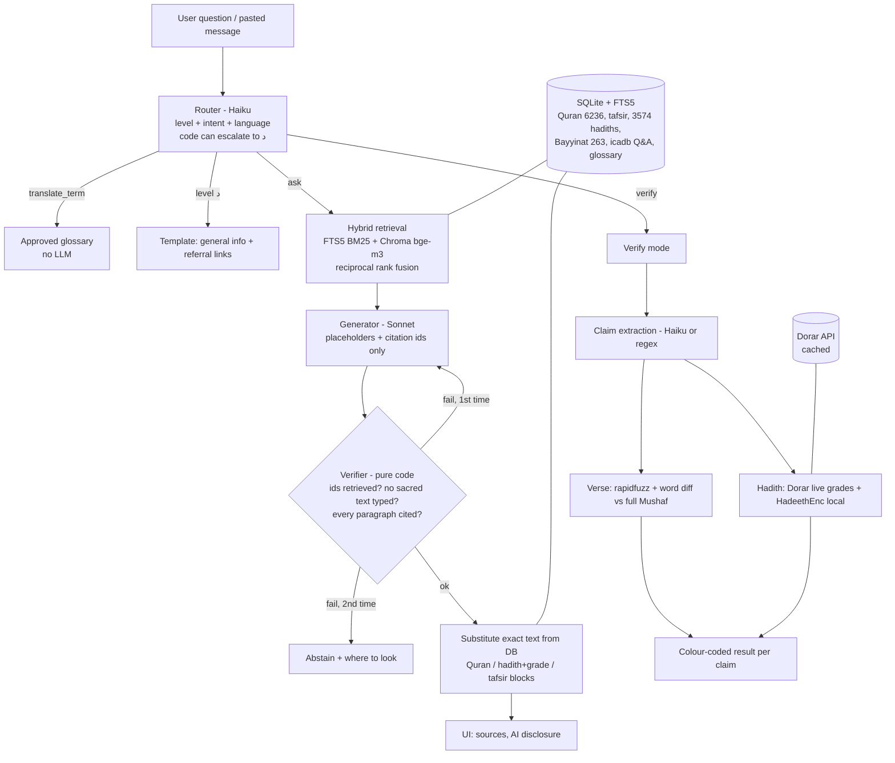

# بصيرة — Baseera

**An Arabic-first, grounded Islamic Q&A and verification assistant** built for the *AI Challenge Serving Islamic Content*.

Baseera answers **only** from approved sources, shows a citation for every claim, separates Quran / hadith / tafsir text from AI-generated explanation, and **abstains** (with places to look) when the evidence is not enough. It is an AI tool, not a mufti, and stores no personal data.

Two modes:

1. **Ask** — a question in Arabic or English → a sourced answer with source cards.
2. **Verify** — paste a viral message → every verse and hadith in it is checked: verified verse / misquoted verse (correct text + word diff) / hadith graded by scholars / not found in approved sources.

## The design rule that matters

> **The LLM never types a verse or a hadith.** It emits placeholders (`{{quran:2:255}}`, `{{hadith:hadeethenc:4560}}`, `{{tafsir:2:255}}`) and `[[passage-id]]` citations. Plain code (`core/verify.py`, no LLM) checks them and substitutes the exact stored text.

Enforced in code, not just prompts:

| Rule | Where |
|---|---|
| Placeholders/citations must refer to passages *retrieved for this question* (invented ids fail) | `core/verify.py` |
| Model-written Quran text is rejected (ornate brackets, quotes, or fuzzy-matching ≥93% against the whole Mushaf) | `core/verify.py` |
| Arabic text in quotation marks only as a verbatim, cited quote of a retrieved scholarly passage | `core/verify.py` |
| Every paragraph carries a citation | `core/verify.py` |
| On verification failure: regenerate once with the error fed back, then abstain | `core/pipeline.py` |
| Hadith grades only from Dorar / HadeethEnc data (keyword classification in code, never the model) | `core/verifier_mode.py`, `core/dorar.py` |
| Level **د** (personal case) never reaches the generator: template + general info + referral | `core/pipeline.py` |
| Code can only *escalate* the router's level to د, never relax it | `core/router.py` |
| Approved glossary translations override the model (`ترجم كلمة التوحيد` is answered from the glossary, no LLM) | `core/glossary.py` |
| Any LLM/API failure fails closed (abstain), never guesses | `core/pipeline.py` |

## Architecture



## Sources

| Source | Used for | How |
|---|---|---|
| King Fahd Complex Mushaf (Hafs v3.0 JSON) | Quran text — ground truth, 6,236 verses asserted | local zip |
| QuranEnc `english_saheeh` (Noor International) | English translation of verses | local sqlite zip |
| KFGQPC *Tafseer Muyassar* | Arabic concise tafsir, verse level (kept separate from Quran text) | local zip |
| HadeethEnc.com | 3,574 authenticated hadiths with explanations, grades (Arabic + English). *Credit to HadeethEnc.com is shown; content is never modified.* | API → SQLite |
| Bayyinat (dawa.center/file/7937) | 263 Q&As on doubts and objections (PDF parsed; Arabic ligature corruption repaired) | local PDF |
| icadb.com | 543 approved Q&A cards, 58 approved terminology cards | API → SQLite |
| Glossary (docs/data.pdf p.7) | approved English equivalents; override machine translation | code |
| Dorar `dorar_api.json` | scholars' hadith grades (live, cached, polite throttling) | API |
| mp3quran.net | optional recitation audio on verse cards | API |
| islamqa.info, binbaz.org.sa, binothaimeen.net | referral links only (never scraped) | links |

## Run it

Requires Python 3.13 (3.11+ should work). First time:

```bash
python -m venv .venv && .venv\Scripts\activate      # Windows; use source .venv/bin/activate elsewhere
pip install -r requirements.txt
echo ANTHROPIC_API_KEY=sk-ant-... > .env              # needed for Ask/Verify LLM steps (everything else runs without it)
python ingest/download_raw.py                         # fetches QuranEnc + Bayyinat; tells you which Quran Complex zips to place by hand
python ingest/build_all.py                            # ingest everything + embed (bge-m3, ~30-60 min on CPU, resumable)
uvicorn api.main:app                                  # http://127.0.0.1:8000
```

Manual files (from https://qurancomplex.gov.sa/quran-dev): `data/raw/quran/kfgqpc_hafs_v30.zip`, `data/raw/tafsir/hafs_tafseerMouaser_v3.zip`.

Without `ANTHROPIC_API_KEY` the app still runs: routing falls back to heuristics, level-د referral, glossary translation and **Verify mode** work, and Ask returns the closest approved sources (`retrieval_only`) instead of a generated answer. Nothing is ever fabricated.

```bash
python -m pytest -q                      # tests (data integrity, normalization, verifier adversarial cases, pipeline, verify mode)
python evals/run_evals.py                # golden-set evaluation -> evals/reports/latest.html
python evals/run_evals.py --offline      # the subset that needs no LLM
```

Pages: `/` main UI · `/retrieval` raw hybrid-retrieval debug view · `/docs` API.

## Evaluation

`evals/golden.jsonl` has the 12 challenge test cases (docs/data.pdf p.6) + 40 more (15 level أ, 10 ب, 5 ج, 5 د, 5 viral messages). The 4 viral entries marked `provisional` are well-known weak/fabricated hadiths — replace them with real examples from Dorar's *widespread hadiths* section.

EVAL_RESULTS_PLACEHOLDER

## Assumptions and limits (read these)

- **Tafsir vectors are not embedded** (6,236 long passages are too slow on CPU); tafsir stays keyword-searchable and any retrieved tafsir pulls in its verse. Quran verses, hadiths, Q&A and terms are embedded with `BAAI/bge-m3`.
- **Quran text** comes from the KFGQPC `v30` JSON (real Unicode, 6,236 verses). The `hafs_smart_v8` JSON is *not* used: its main field is private-use font glyphs.
- **Glossary**: only 10 official terms (p.7). icadb's *approved* terminology cards are Hajj terms without English equivalents, so the broader glossary is not machine-translated.
- **Hadith grade classification** (sound / weak / fabricated) is keyword-based on scholars' grade text from Dorar/HadeethEnc; when scholars disagree the result is "mixed" (amber) and every grade is shown. A HadeethEnc sound match with ≥90% text similarity decides "sound".
- **Verse check** is complete (full local Mushaf): a quoted "verse" with no close match is reported as *not in the Mushaf* (red). Hadith with no match is only *not found in approved sources* (grey) — absence from Dorar is not proof of fabrication.
- **Dorar** has no hadith IDs and no documented rate limit; Baseera derives a stable hash id, throttles to ~1 request/second and caches. It needs a browser User-Agent (Cloudflare).
- icadb Q&A answers may contain quoted verses (`﴿…﴾`); the generator is told never to copy them, and the verifier rejects verse-like text it writes.
- Router uses Haiku with heuristic fallback; the personal-case detector is regex-based and conservative toward level د.
- Dorar's *widespread hadiths* examples for the demo are provisional (see above).

## Repo layout

```
docs/    challenge PDFs            ingest/  download + ingest + embed scripts
core/    normalize, db, retrieve, dorar, router, generate, verify, verifier_mode, pipeline, glossary, audio
api/     FastAPI app               web/     single-page RTL UI (Arabic/English)
evals/   golden set + runner       tests/   pytest suite
data/    raw (inputs), db (SQLite + Chroma), cache (API responses), samples
```
